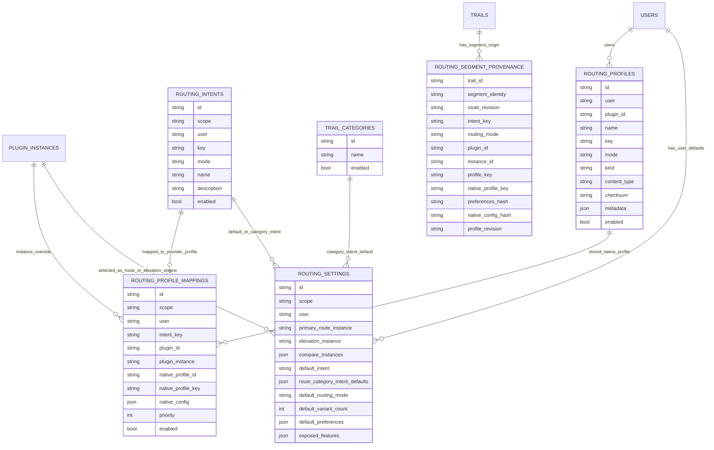

# Routing Plugin Concept

> **Internal design document**
> This is the design rationale and target narrative for the routing plugin.
> The **normative, testable specification** lives in `openspec/specs/routing/`
> and the phase deltas under `openspec/changes/`. On any conflict, OpenSpec
> is authoritative; this document explains the "why" and will be removed once
> the phases are implemented and manually validated.

This document describes the target state for routing plugins in Wanderer. It builds on the plugin system for `trails` plugins and its extension for `assets` plugins. The goal is to replace the current direct Valhalla integration with a generic `routing` plugin type. Valhalla remains the first first-party routing plugin; BRouter, as the second first-party plugin, demonstrates that the abstraction also holds for a structurally different engine.

## Target state

Wanderer treats routing and elevation as interchangeable plugin capabilities behind a provider-neutral host API. Users think in Wanderer intents such as walking, touring bike, gravel, or car, not in provider-specific terms. Multiple engines can answer the same request in parallel, so the editor can show comparable alternatives side by side.

Valhalla and BRouter are both intended to be first-party routing plugins. Valhalla is costing-/options-based, BRouter is profile- and `.brf`-based. Together they test the most important architectural question: whether Wanderer can offer a shared routing language without having to translate the providers' native profile languages into one another.

For concept validation, GraphHopper is kept in mind as a third reference case. GraphHopper is not the primary implementation focus, but it helps validate the abstraction against another open routing engine: predefined profiles, custom models, alternative routes, elevation, and a server-side HTTP API are shaped differently there than in Valhalla and BRouter.

## Key decisions

- The canonical Wanderer intent is the shared routing language and the authoritative comparison key. Comparability is defined only within the same intent key.
- Native profiles are plugin dialects. Mappings are the mandatory bridge between Wanderer intents and provider-specific profiles or options.
- The frontend speaks exclusively the Wanderer routing host API. Provider-specific request/response formats, credentials, and protocol details stay in the plugin layer. Provider-specific tuning options may still be exposed through host-mediated advanced controls declared by the plugin.
- The host owns discovery, user instances, orchestration, parallel fan-out, partial-failure aggregation, policy enforcement, and persistence. Plugins own only the translation into the provider protocol.
- `route.v1` and `elevation.v1` are independent capabilities. Routing and elevation can come from different plugins.
- Users can create their own routing profiles, including provider-specific profile files such as BRouter `.brf`.
- Multiple routing engines can be active for the same user. A user or admin defines a primary routing engine for the default single-route path; additional engines may be selected for comparison, variants, elevation, or advanced workflows.
- Because the editor is segment-oriented, the host may compose an accepted route from segment candidates produced by different engines in `segment` routing mode, as long as composition happens only at existing anchor boundaries and all segments share the same canonical intent. `via` candidates are atomic per engine and are not cross-engine composed, even though accepting them still materializes editor segments.

## Permanent boundaries

- No shared native profile language: Wanderer intents map onto native profiles. They do not translate BRouter `.brf` profiles into Valhalla `costing_options` or vice versa.
- No mid-segment provider stitching: the host may combine complete anchor-pair segments from different engines, but it does not cut provider geometries inside a segment and splice arbitrary sub-segments into a new synthetic path.
- Plugins get no direct network access. They keep using the existing host requests via declared connectors.
- Plugins do not persist arbitrary files themselves. User profiles and profile files belong to the host and are passed to plugins only as bounded input.

## Current state

Routing is currently tightly coupled to Valhalla:

- `/api/v1/valhalla/route` proxies Valhalla `/route`.
- `/api/v1/valhalla/height` proxies Valhalla `/height`.
- `web/src/lib/models/valhalla.ts` models Valhalla costing and responses.
- `web/src/lib/stores/valhalla_store.svelte.ts` builds Valhalla requests, decodes Valhalla shapes, and calls height correction.
- `GPX.correctElevation()` calls `/api/v1/valhalla/height` directly.

The desired state is:

- The frontend owns route editing, GPX state, and UI behavior.
- The backend host owns plugin discovery, user instances, orchestration, policy, and persistence.
- Routing plugins own provider-specific protocol translation.

## Plugin manifest

A routing plugin uses the existing plugin bundle structure:

```json
{
  "manifestVersion": "1.0",
  "id": "valhalla",
  "type": "routing",
  "name": "Valhalla",
  "version": "0.1.0",
  "runtime": {
    "type": "wasm",
    "entrypoint": "plugin.wasm"
  },
  "capabilities": [
    {
      "name": "route",
      "version": "v1",
      "export": "route_v1"
    },
    {
      "name": "elevation",
      "version": "v1",
      "export": "elevation_v1"
    }
  ],
  "permissions": {
    "network": {
      "connectors": [
        {
          "name": "api",
          "type": "configured",
          "configKey": "valhalla",
          "allowedPathPrefixes": ["/route", "/height"]
        }
      ]
    },
    "downloads": {
      "maxBytes": 4194304,
      "contentTypes": ["application/json"]
    }
  },
  "hostConfig": {
    "connectors": {
      "valhalla": {
        "baseURL": "https://valhalla1.openstreetmap.de",
        "basePath": "",
        "allowPrivate": false
      }
    },
    "routing": {
      "roles": ["route", "elevation"],
      "defaultProfiles": ["pedestrian", "hiking", "bicycle", "mountain_bike", "auto"]
    }
  },
  "metadata": {
    "routing": {
      "version": "v1",
      "roles": ["route", "elevation"],
      "modes": ["foot", "bike", "motor"],
      "supportsViaRouting": true,
      "supportsAlternatives": true,
      "maxAlternatives": 3,
      "supportsRouteElevation": true,
      "supportsElevation": true,
      "nativeControlDiscovery": {
        "enabled": true,
        "scope": "profile"
      },
      "nativeProfileUpload": {
        "enabled": false
      }
    }
  }
}
```

The manifest describes what a plugin can do. It is not the source of user preferences. Settings such as "BRouter as the primary routing engine and Valhalla for elevation" live in host-owned user settings.

## Capabilities

Routing plugins start with two independent capabilities.

| Capability | Purpose |
| --- | --- |
| `route.v1` | Computes one or more route candidates between ordered anchor points. |
| `elevation.v1` | Returns elevation values for an existing line or point list. |

The separation matters because an engine may be strong at one task and not the other. BRouter can provide strong routing while Valhalla still supplies elevation. A future elevation-only plugin should be valid without implementing `route.v1`.

### `route.v1` input

The host sends normalized, already-resolved routing input to the selected plugin. The canonical Wanderer intent is not part of the plugin input; the host has already translated it into a native profile, `nativeConfig`, and canonical preferences.

```json
{
  "instance": {
    "id": "abc123",
    "pluginId": "brouter"
  },
  "auth": {},
  "config": {},
  "request": {
    "routingMode": "segment",
    "anchors": [
      { "lat": 47.3769, "lon": 8.5417 },
      { "lat": 47.3850, "lon": 8.5600 }
    ],
    "mode": "bike",
    "profile": {
      "id": "profile_123",
      "pluginId": "brouter",
      "key": "trekking",
      "kind": "builtin",
      "contentBase64": "",
      "contentType": "",
      "nativeConfig": {}
    },
    "preferences": {
      "speedPreference": 0.5,
      "hillPreference": 0.5
    },
    "requiredPreferences": [],
    "options": {
      "alternatives": 3,
      "includeElevation": false
    }
  }
}
```

`request.routingMode` tells the plugin how to interpret `anchors`. In `segment` mode, the plugin receives exactly one anchor pair and returns candidates for that point-to-point segment. This is the mandatory `route.v1` baseline. In `via` mode, the plugin should route the full ordered anchor list as one provider request with intermediate via/through points. The host only sends `via` when plugin discovery declares `supportsViaRouting`.

`preferences` are intentionally generic and optional. A plugin maps supported values into its native format and ignores unsupported values. Provider-specific advanced settings belong in native profiles, plugin configuration, or `native_config`, not in the generic API. `profile.nativeConfig` is the delivery path for such resolved provider-specific mapping options, e.g. Valhalla `costing_options` or template parameters for a BRouter profile. `mode` is kept in the plugin input as a convenience and validation aid, even though many plugins can derive it from the resolved profile.

`auth` and `config` are not routing-specific schemas. They are the host-resolved instance data provided by the base plugin system for this concrete plugin invocation. `config` holds non-secret instance configuration, `auth` holds only the auth metadata or references released to the plugin. Credentials for provider HTTP requests are still attached by the host at the connector. The routing specification treats both objects as opaque; a routing plugin must document its expected config fields in the plugin metadata. When no data is needed, the host sends `{}`.

`options.alternatives` is the number of native candidates the host requests from this specific engine; it is not the same as the final UI count `desiredVariants`. `options.includeElevation` may be `false` even when the host request asked for elevation, if the host orchestrates elevation separately via `elevation.v1`.

### `route.v1` output

Plugins liefern normalisierte Routenkandidaten:

```json
{
  "candidates": [
    {
      "id": "primary",
      "profileKey": "trekking",
      "geometry": {
        "format": "encoded_polyline",
        "precision": 6,
        "coordinates": "..."
      },
      "summary": {
        "distance": 1234.5,
        "duration": 987,
        "elevationGain": 120.0,
        "elevationLoss": 118.0
      },
      "segments": [
        {
          "fromAnchor": 0,
          "toAnchor": 1,
          "geometry": {
            "format": "encoded_polyline",
            "precision": 6,
            "coordinates": "..."
          },
          "distance": 1234.5,
          "duration": 987
        }
      ],
      "warnings": []
    }
  ],
  "error": null
}
```

The plugin does not provide `provider`, `pluginId`, or `instanceId` fields in the candidate. The host knows this provenance from the invocation and adds it only in the host route response.

Required:

| Field | Required |
| --- | --- |
| `candidates` or `error` | Exactly one usable result form. |
| `candidate.id` | Native candidate ID, unique within the plugin response. |
| `candidate.segments` | Segment contract for all adjacent anchor pairs. |
| `candidate.summary.distance` | Total distance in meters. |
| `candidate.summary.duration` | Total duration in seconds. |
| `segment.fromAnchor` / `segment.toAnchor` | Anchor assignment of the segment. |
| `segment.distance` | Segment distance in meters. |
| `segment.duration` | Segment duration in seconds. |
| `segment.geometry` | Segment polyline for the requested anchor pair. |

Optional:

| Field | Meaning |
| --- | --- |
| `candidate.geometry` | Full geometry for preview and comparison. |
| `candidate.snappedAnchors` | Engine-resolved anchor positions (same order/count as the request anchors) when the engine snapped an anchor to the routable network, so the editor can reflect where routing actually started/ended. |
| `summary.elevationGain` / `summary.elevationLoss` | Elevation metric when the plugin knows usable heights. |
| `summary.surface` / `summary.wayTypes` | Optional normalized breakdown (e.g. paved/unpaved share, way-type mix). On the roadmap because a programmatic/agent consumer benefits from richer comparable metadata; not required, and only populated when the engine provides it. |
| `warnings` | Plugin warnings about the candidate or result. |

The mandatory geometry format for plugin output is `encoded_polyline` with `precision: 6`. This format is normatively fixed: it uses the Google Encoded Polyline Algorithm with scaling factor `1e6`. The decoded point list consists of WGS84 pairs in the order `[lat, lon]`, i.e. latitude first and longitude second. This order applies to candidate geometries, segment geometries, and `elevation.v1` geometries. GeoJSON-style `[lon, lat]` coordinates are not allowed in this field. GPX and GeoJSON are not mandatory output formats for plugins; the host remains the sole GPX authority.

The host converts accepted candidates to GPX for the existing editor. The current editor is segment-oriented: each stretch between two adjacent anchor points exists as one `trkseg`, and undo/redo, insert, edit, delete, crop, and anchor reordering operate on these segment indices. A route candidate must therefore preserve the relationship between anchors and segments.

Segment routing provenance is persisted by Wanderer as host-owned trail metadata, not as the canonical GPX representation. The preferred persistence shape is a side record per trail segment, keyed by trail id plus stable segment identity (or segment index plus route revision), containing the routing provenance needed for mismatch detection, details/debug display, and future re-routing. GPX `trkseg` remains the geometry/time/elevation representation for the editor and export; GPX extensions may be used as optional diagnostic/export metadata, but they are not the authoritative source for routing provenance.

Consequently, exported GPX that is later imported again is treated like any other imported route: its routing provenance is `unknown`, it is inert, and unknown provenance alone must not trigger repeated re-route prompts. This avoids coupling Wanderer's internal routing model to GPX extension compatibility across clients.

`geometry` at the candidate level is optional full geometry. It is useful for preview, comparison, and summary. `segments` is the editor-compatible contract and must contain one segment per adjacent anchor pair:

```text
anchors[0] -> anchors[1] = segments[0]
anchors[1] -> anchors[2] = segments[1]
anchors[n] -> anchors[n+1] = segments[n]
```

Each segment must contain its own encoded-polyline geometry, distance, and duration. This is required because the host materializes each segment directly as one GPX `trkseg` and derives per-segment timestamps from `duration`. If a provider returns only one optimized full geometry internally, the plugin is responsible for deriving the requested segment geometries before returning `route.v1`. A candidate that cannot provide one geometry-bearing segment per requested adjacent anchor pair is invalid and must be rejected with `candidate_segment_mismatch` or `candidate_geometry_invalid`.

The editor should no longer need to know whether the line came from Valhalla, BRouter, GraphHopper, OSRM, or a host-native straight line.

### `elevation.v1` input

Elevation requests must work with lines that come from any plugin or from a host-native straight line:

```json
{
  "instance": {
    "id": "def456",
    "pluginId": "valhalla"
  },
  "auth": {},
  "config": {},
  "request": {
    "geometry": {
      "format": "encoded_polyline",
      "precision": 6,
      "coordinates": "..."
    },
    "options": {
      "preserveExisting": true
    }
  }
}
```

`geometry` uses, like `route.v1`, the mandatory format `encoded_polyline` with `precision: 6`. `options.preserveExisting` signals that, for missing or invalid new heights, the host should keep existing GPX heights point by point.

`auth` and `config` follow the same semantics as in `route.v1`: they are opaque instance data from the base plugin system, not part of the provider-neutral elevation contract.

### `elevation.v1` output

```json
{
  "heights": [412.3, null, 415.8],
  "source": {
    "label": "Valhalla height"
  },
  "warnings": [
    {
      "code": "elevation_partial",
      "message": "Height missing for 1 point."
    }
  ],
  "error": null
}
```

Rules:

- `heights.length` must match the number of decoded geometry points, unless the plugin returns a structured error.
- Each height value is meters above sea level or `null`.
- `null` means: the plugin has no reliable height for this point.
- Valid new height values replace existing heights point by point.
- For `null`, the host keeps the existing GPX height for that point, if present.
- If no existing height exists for a `null`, the point stays without a height.

From an `elevation.v1` call the host derives only the status values `complete`, `partial`, or `failed`. `included`, `none`, and `pending` are purely host-side states. The canonical enum table is in the host route response.

## Provider profile landscape

"Profile" means something different depending on the engine. Wanderer must therefore distinguish between generic Wanderer intents for standard users and provider-native profiles for advanced use cases.

For standard users, Wanderer offers a stable list of canonical intents. For advanced users, plugins can additionally offer provider-specific profiles, options, or upload formats.

### Valhalla profiles

Valhalla primarily does not offer named profile files. Valhalla uses `costing` models plus `costing_options`. A Valhalla plugin maps Wanderer intents onto these costings and option presets.

Documented Valhalla costing models:

| Valhalla costing | Wanderer category | Notes |
| --- | --- | --- |
| `pedestrian` | Foot | Walking routing; slightly prefers sidewalks and footways, slightly avoids steps and alleys. |
| `bicycle` | Bike | Bicycle routing with configurable bike type, surface, hills, roads, ferries, and speed. |
| `auto` | Motor | Car routing with car access and turn restrictions. |
| `truck` | Motor | Like car, but with truck access and vehicle limits such as width, height, and weight. |
| `bus` | Motor / transit operations | Road routing for buses. Not really relevant for regular Wanderer users. |
| `taxi` | Motor | Like car, but can prefer taxi-accessible lanes. |
| `motor_scooter` | Motor | Scooter/moped routing, typically avoiding higher road classes. |
| `motorcycle` | Motor / Adventure | Beta; can be tuned between road touring and tracks/trails. |
| `bikeshare` | Mixed | Beta; combines foot and bicycle routing via bike-share stations. |
| `auto_pedestrian` | Mixed | Beta; starts by car and ends on foot, with parking lots as the transition. |
| `multimodal` | Transit | Foot plus transit; needs transit data and is not a simple outdoor profile. |

Valhalla also supports options such as `shortest`, avoid/favor factors, hard exclusions, alternative routes, language, date/time, and format options. The plugin should show standard users only a curated subset and treat raw `costing_options` as provider-specific advanced configuration.

Reasonable Valhalla built-ins for Wanderer:

| Wanderer profile | Valhalla mapping |
| --- | --- |
| `walking` | `pedestrian` with conservative walking defaults. |
| `hiking` | `pedestrian` with trail-/track-friendly and hill-aware options where possible. |
| `road_bike` | `bicycle` with `bicycle_type: "Road"` and a preference for paved roads. |
| `touring_bike` | `bicycle` with `bicycle_type: "Hybrid"` and balanced road/cycleway preference. |
| `mountain_bike` | `bicycle` with `bicycle_type: "Mountain"` and higher tolerance for tracks/surfaces. |
| `car` | `auto`. |
| `scooter` | `motor_scooter`. |
| `motorcycle` | `motorcycle`, marked as advanced or beta. |

### BRouter profiles

BRouter is profile-centric. A profile is a `.brf` cost-function script, not just a preset name. This makes BRouter especially well suited to uploaded user profiles, because the native format already expresses personal routing preferences.

BRouter uses `profiles2` for the lookup table and routing profiles. It also describes a mapping layer between routing modes and routing profiles. The public BRouter profile directory includes, among others:

| BRouter profile | Wanderer category | Notes |
| --- | --- | --- |
| `trekking` | Bike / Touring | Balanced bicycle profile and a common default for everyday/touring routes. |
| `trekking-noferries` | Bike / Touring | Trekking variant without ferries. |
| `trekking-nosteps` | Bike / Touring | Trekking variant without steps. |
| `trekking-steep` | Bike / Touring | Trekking variant with different hill handling. |
| `trekking-ignore-cr` | Bike / Touring | Trekking variant that ignores cycle-route preference. |
| `fastbike` | Bike / Road | Faster bicycle profile with stronger road-speed orientation. |
| `fastbike-lowtraffic` | Bike / Road | Fast bicycle profile with stronger low-traffic preference. |
| `fastbike-verylowtraffic` | Bike / Road | Fast bicycle profile with even stronger traffic avoidance. |
| `gravel` | Bike / Gravel | Gravel-oriented bicycle routing. |
| `mtb` | Bike / MTB | Mountain-bike-oriented routing. |
| `shortest` | Foot / generic | Shortest route; useful as a baseline, but not always pleasant. |
| `hiking-mountain` | Foot / Hiking | Mountain hiking profile. |
| `moped` | Motor | Moped-/scooter-like routing. |
| `car-eco`, `car-fast`, `car-vario` | Motor | Car variants in the public profile directory. |
| `skating` | Other | Skating-oriented profile. |
| `rail`, `river`, `all`, `dummy`, `softaccess` | Special / Diagnostic | For special cases, tests, or non-standard routing. |

The BRouter plugin should treat built-in profiles and uploaded `.brf` files in the same conceptual slot: both are provider-native profiles. Standard users pick Wanderer intents; advanced users can select native BRouter profiles directly or upload their own `.brf` files.

### GraphHopper as a validation case

GraphHopper is valuable for concept validation, even though Valhalla and BRouter remain the primary implementation focus. GraphHopper is an open OSM routing engine, can run as a Java library or a standalone server, and ships predefined profiles such as `car`, `bike`, `racingbike`, `mtb`, `foot`, `hike`, `truck`, `bus`, and `motorcycle`. GraphHopper also supports custom models that adjust profiles per request without Java code.

For Wanderer, GraphHopper tests three important assumptions:

- Canonical Wanderer intents can be mapped not only onto Valhalla costings and BRouter `.brf`, but also onto yet another profile/custom-model concept.
- Generic preferences such as road/surface/hill preference can be expressed as custom-model rules or profile selection, without Wanderer adopting the GraphHopper language as a global profile language.
- Alternative routes and elevation also exist outside Valhalla, so the `route.v1` and `elevation.v1` capabilities must not be modeled in a Valhalla-specific way.

GraphHopper should therefore appear in examples and in the validation matrix as a validation engine. A first-party GraphHopper plugin is possible for the target state but not necessary to keep the initial implementation focus on Valhalla and BRouter. The exact GraphHopper custom-model mappings are not a prerequisite for the routing plugin specification; they become relevant only when a concrete GraphHopper plugin is built.

## Canonical Wanderer intents

The provider comparison suggests a layered model:

1. Generic `mode` for UI grouping and compatibility checks.
2. Canonical Wanderer `intent` for standard users and multi-provider comparison.
3. Plugin mapping from Wanderer intent to provider-native profile or config.
4. Optional provider-native profile or config for advanced users.

Wanderer intents are the application's shared routing language. Provider-native profiles are plugin dialects. Mappings are the dictionary between them. For multi-provider routing this is central: BRouter `trekking` and Valhalla `bicycle` are comparable only if Wanderer knows that both map onto the same canonical intent such as `bike_balanced`.

Suggested standard generic modes:

| Mode | Meaning |
| --- | --- |
| `foot` | Walking, hiking, running, and pedestrian access. |
| `bike` | Bicycle routing of any kind. |
| `motor` | Car, motorcycle, scooter, truck, and similar road vehicles. |

Reserved/future extension modes:

| Mode | Meaning |
| --- | --- |
| `mixed` | Route deliberately switches between modes. |
| `transit` | Public-transport-aware routing. |
| `other` | Special profiles such as skating, rail, river, or diagnostics. |

`mixed`, `transit`, and `other` are not part of the regular Wanderer routing surface. They may be useful for future plugins or diagnostics, but they should not appear as standard user-facing modes until Wanderer defines comparable intents and UI behavior for them.

Suggested standard intents:

| Intent | Mode | Standard-user label | Typical provider mapping |
| --- | --- | --- | --- |
| `walk` | `foot` | Walking | Valhalla `pedestrian`; BRouter `shortest` or a walking profile if installed. |
| `run` | `foot` | Running | Valhalla `pedestrian` with higher speed and a more direct profile; BRouter walking/hiking profile or custom `.brf`; GraphHopper `foot` with a matching custom model. |
| `hike` | `foot` | Hiking | Valhalla `pedestrian` hiking preset; BRouter `hiking-mountain`. |
| `mountain_hike` | `foot` | Mountain hiking | Valhalla `pedestrian` with high path/hill tolerance; BRouter `hiking-mountain` with `SAC_scale_limit`/`SAC_scale_preferred`; GraphHopper `hike`. |
| `bike_balanced` | `bike` | Touring bike | Valhalla `bicycle` hybrid preset; BRouter `trekking`. |
| `bike_fast` | `bike` | Fast bike | Valhalla `bicycle` road preset; BRouter `fastbike`. |
| `bike_low_traffic` | `bike` | Quiet bike route | Valhalla `bicycle` with low-road preference where possible; BRouter `fastbike-lowtraffic` or `fastbike-verylowtraffic`. |
| `gravel` | `bike` | Gravel | Valhalla `bicycle` cross-/mountain-like preset; BRouter `gravel`. |
| `mtb` | `bike` | Mountain bike | Valhalla `bicycle` mountain preset; BRouter `mtb`. |
| `car` | `motor` | Car | Valhalla `auto`; BRouter `car-fast` or `car-vario`. |
| `scooter` | `motor` | Scooter / moped | Valhalla `motor_scooter`; BRouter `moped`. |
| `motorcycle` | `motor` | Motorcycle | Valhalla `motorcycle`; BRouter custom/native profile if available. |

`run` deliberately overlaps with `walk` plus a faster `speedPreference`. The dedicated intent is meant as a UI shortcut and a semantic user intent: running can get more direct paths, different comfort assumptions, and different default speeds without standard users having to tune a walking profile manually.

### Canonical routing preferences

Beyond the intent, Wanderer still needs simple tuning options in the route planner. These options should not be provider-specific, but should hang off the request as small, mode-specific `preferences`. They modify the selected intent but do not replace it.

Example: `bike_balanced` describes the basic intent "touring bike". The preference `hillPreference: 0.2` only says that this touring-bike intent should rather avoid hills. Another provider may derive different native cost factors from it, as long as the rough user intent is preserved.

For standard users, only preferences that are meaningfully supported for the selected mode and the active engine should be visible. In parallel routing, a preference is comparable only if all selected engines declare a mapping for it. Otherwise the host can hide the option, mark it as only partially supported, or move it into the provider-specific advanced area.

Today's editor sliders are therefore no longer Valhalla special cases, but are mostly modeled as canonical Wanderer preferences. They stay visible in the standard editor when the host can resolve them as sufficiently supported for the active engine or the active engine combination. Provider-specific advanced controls remain only for options that have no comparable Wanderer semantics or that deliberately write directly into native config.

Generic preferences should deliberately stay small:

| Preference | Type | Modes | Meaning |
| --- | --- | --- | --- |
| `shortest` | boolean | all | Weight a shorter distance more heavily than comfort, speed, or quality. |
| `speedPreference` | number `0..1` | `foot`, `bike`, `motor` | Relative speed preference: `0` slow/relaxed, `0.5` neutral, `1` fast. The plugin interprets the range intent-/profile-dependently. |
| `hillPreference` | number `0..1` | `foot`, `bike` | `0` strongly avoids climbs, `0.5` is neutral, `1` accepts or prefers hilly ways more. |
| `maxHikingDifficulty` | enum or number | `foot` | Maximum accepted hiking/SAC difficulty. |
| `bicycleType` | enum | `bike` | Bicycle type, e.g. `road`, `hybrid`, `city`, `cross`, `mountain`. |
| `roadPreference` | number `0..1` | `bike` | `0` avoids roads more, `1` uses roads more. |
| `avoidBadSurfaces` | number `0..1` | `bike` | Higher values avoid bad or unknown surfaces more strongly. |
| `topSpeedKmh` | number | `motor` | Maximum vehicle speed. |
| `vehicleWidthM` | number | `motor` | Vehicle width for routing with width restrictions. |
| `vehicleHeightM` | number | `motor` | Vehicle height for routing with height restrictions. |

Concrete km/h values such as Valhalla `walking_speed`, `cycling_speed`, or `fixed_speed` are provider-native units. The standard UI should expose the relative `speedPreference`; plugins map it to concrete speed ranges according to the resolved intent and native profile. Engines that need exact speeds can expose them in the provider-native advanced section.

This list covers the current editor options:

| Current mode | Current option | Canonical preference |
| --- | --- | --- |
| Car | fixed speed | `speedPreference` |
| Car | top speed | `topSpeedKmh` |
| Car | vehicle width | `vehicleWidthM` |
| Car | vehicle height | `vehicleHeightM` |
| Hiking | walking speed | `speedPreference` |
| Hiking | include hills | `hillPreference` |
| Hiking | maximum hiking difficulty | `maxHikingDifficulty` |
| Cycling | bicycle type | `bicycleType` |
| Cycling | cycling speed | `speedPreference` |
| Cycling | include hills | `hillPreference` |
| Cycling | use roads | `roadPreference` |
| Cycling | avoid bad surfaces | `avoidBadSurfaces` |
| all car routing modes | shortest | `shortest` |

Suggested provider mappings:

| Preference | Valhalla | BRouter | GraphHopper |
| --- | --- | --- | --- |
| `shortest` | `shortest` in `costing_options`. | Own profile or `.brf` template with stronger distance weighting; possibly native `shortest` for foot. | Shorter route via custom model / weighting or an alternative profile, if supported. |
| `speedPreference` | Maps to `walking_speed`, `cycling_speed`, or `auto.fixed_speed` using intent-/profile-specific ranges. | Dynamic `.brf` from a template; depending on the profile via variables such as `maxSpeed`, `bikerPower`, `totalMass`, `vmax`, or custom time costs. | Custom model can influence speed/cost; exact mapping is profile/server specific. |
| `hillPreference` | `use_hills` for `pedestrian` and `bicycle`. | `.brf` template via `consider_elevation`, `uphillcost`, `downhillcost`, and cutoff values. | Custom model with elevation/grade data, provided the profile/server exposes those encoded values. |
| `maxHikingDifficulty` | `max_hiking_difficulty` in the `pedestrian` costing. | `.brf` template via `SAC_scale_limit` and `SAC_scale_preferred`. | `hike` profile or custom model, provided SAC-/trail-difficulty data is available. |
| `bicycleType` | `bicycle_type`: `Road`, `Hybrid`, `City`, `Cross`, `Mountain`. | Selection of a native profile such as `fastbike`, `trekking`, `gravel`, `mtb`, or a matching `.brf` template. | Profile selection such as `bike`, `racingbike`, `mtb` plus custom model. |
| `roadPreference` | `use_roads` in the `bicycle` costing. | `.brf` template with adjusted costs for road classes, cycleways, tracks, and traffic variables. | Custom model via road-class/road-environment rules. |
| `avoidBadSurfaces` | `avoid_bad_surfaces` in the `bicycle` costing. | `.brf` template with surface/smoothness costs. | Custom model via `surface`, `smoothness`, or comparable encoded values. |
| `topSpeedKmh` | `top_speed` in the `auto` costing. | Car profiles such as `car-vario` can express speed via variables such as `vmax`. | Custom model can cap speed if the profile allows it. |
| `vehicleWidthM` | `width` in the `auto`/vehicle-related costing. | Only possible if data and the `.brf` profile explicitly evaluate width restrictions; no guaranteed standard. | Rather a truck/vehicle profile or custom model, depending on enabled encoded values. |
| `vehicleHeightM` | `height` in the `auto`/vehicle-related costing. | Only possible if data and the `.brf` profile explicitly evaluate height restrictions; no guaranteed standard. | Rather a truck/vehicle profile or custom model, depending on enabled encoded values. |

BRouter is the most important special case here: many preferences are not parameters of a stable HTTP format, but part of the `.brf` cost function. The BRouter plugin can therefore offer two paths:

- fixed native profiles such as `trekking`, `fastbike`, `gravel`, `mtb`, `hiking-mountain`, `car-fast`, or `car-vario`;
- generated user profiles from safe `.brf` templates, where Wanderer preferences are inserted into bounded placeholders.

Template-based `.brf` generation is provider-specific and stays in the BRouter plugin. The host only stores the resulting native profile or the template parameters, validates size and origin, and passes them to the plugin in a bounded way. Wanderer itself does not become a BRouter profile engine.

This taxonomy is authoritative for comparability, but extensible. Wanderer should ship a small default list for regular users. Admins can add instance-wide intents such as `bike_commute` or `trail_run`. Users can create personal variants or aliases, but must not silently override the global meaning of an admin intent.

A custom intent without a mapping to two or more selected engines is valid for single-engine routing but not cross-provider comparable. Parallel comparison is defined only for engines mapped onto the same canonical intent key.

Plugins declare which modes and intents they can serve and provide mapping suggestions from generic intents to native profiles. The host can thus show a simple standard UI and still give advanced users direct access to native provider profiles.

### Ownership and mappings

Recommended ownership model:

| Layer | Owner | Purpose |
| --- | --- | --- |
| Built-in Wanderer intents | Wanderer | Stable defaults such as `hike`, `bike_balanced`, `gravel`, and `car`. |
| Custom global intents | Admin | Instance-wide additions with shared semantics, e.g. `bike_commute`. |
| Personal intents or aliases | User | User-specific variants that can override mappings for that user. |
| Native plugin profiles | Plugin / Provider | Provider built-ins such as BRouter `trekking` or Valhalla `pedestrian`. |
| Uploaded native profiles | User | Provider-native custom files such as a BRouter `.brf`. |
| Profile mappings | Admin and User | Translate Wanderer intents into native plugin profiles or config. |

Plugin-declared profiles are useful for discovery and mapping suggestions, but should not be the primary comparison layer. If plugins only report their own profiles, Wanderer would have to guess whether names such as `trekking`, `hybrid`, `touring`, `bike`, `road_bike`, and `fastbike-lowtraffic` are equivalent. That guessing becomes unstable as soon as multiple providers are requested in parallel.

The host resolves routing requests in this order:

1. User-selected Wanderer intent, e.g. `bike_balanced`.
2. User-specific mapping for the selected plugin, if present.
3. Admin mapping for the selected plugin, if present.
4. Plugin-suggested default mapping from manifest metadata.
5. Structured error if no mapping exists.

Examples:

| Wanderer intent | BRouter mapping | Valhalla mapping |
| --- | --- | --- |
| `bike_balanced` | Native profile `trekking` | `costing: "bicycle"` with hybrid/touring options. |
| `bike_commute` | User-uploaded `commute.brf` or native `fastbike-lowtraffic` | `costing: "bicycle"` with low-road and avoid-highway preferences. |
| `hike` | Native profile `hiking-mountain` | `costing: "pedestrian"` with hiking preset. |
| `car` | Native profile `car-fast` or `car-vario` | `costing: "auto"`. |

The standard UI should stay simple: pick an intent and route. Advanced settings can show the resolved native mapping and let admins or users override it.

### Discovery contract

Routing plugins declare their routing capabilities via `metadata.routing`. This discovery data is the machine-readable contract the host uses to suggest mappings, check preferences, and limit the UI to supported controls.

Suggested metadata structure:

```json
{
  "metadata": {
    "routing": {
      "version": "v1",
      "roles": ["route", "elevation"],
      "modes": ["foot", "bike", "motor"],
      "supportsAlternatives": true,
      "maxAlternatives": 3,
      "supportsRouteElevation": true,
      "supportsElevation": true,
      "intents": {
        "bike_balanced": {
          "defaultProfile": "trekking",
          "nativeProfiles": ["trekking", "trekking-noferries", "trekking-nosteps"],
          "preferences": {
            "speedPreference": {
              "support": "template",
              "min": 0,
              "max": 1,
              "default": 0.5
            },
            "hillPreference": {
              "support": "template",
              "min": 0,
              "max": 1,
              "default": 0.5
            },
            "roadPreference": {
              "support": "template",
              "min": 0,
              "max": 1,
              "default": 0.5
            },
            "avoidBadSurfaces": {
              "support": "template",
              "min": 0,
              "max": 1,
              "default": 0.25
            },
            "shortest": {
              "support": "partial",
              "default": false
            }
          },
          "requiredPreferences": []
        },
        "bike_fast": {
          "defaultProfile": "fastbike",
          "nativeProfiles": ["fastbike", "fastbike-lowtraffic", "fastbike-verylowtraffic"],
          "preferences": {
            "speedPreference": {
              "support": "template",
              "min": 0,
              "max": 1,
              "default": 0.7
            },
            "roadPreference": {
              "support": "template",
              "min": 0,
              "max": 1,
              "default": 0.75
            }
          },
          "requiredPreferences": []
        }
      },
      "nativeProfiles": [
        {
          "key": "trekking",
          "label": "Trekking",
          "mode": "bike",
          "intents": ["bike_balanced"],
          "advanced": false
        },
        {
          "key": "fastbike-lowtraffic",
          "label": "Fast bike low traffic",
          "mode": "bike",
          "intents": ["bike_fast", "bike_low_traffic"],
          "advanced": true
        }
      ],
      "nativeProfileUpload": {
        "enabled": true,
        "extensions": [".brf"],
        "contentTypes": ["text/plain"],
        "maxBytes": 65536
      }
    }
  }
}
```

Field semantics:

| Field | Meaning |
| --- | --- |
| `version` | Version of the discovery contract, initially `v1`. |
| `roles` | Roles of the plugin: `route`, `elevation`, or both. |
| `modes` | Coarse Wanderer modes the plugin can serve. |
| `supportsViaRouting` | Plugin can route the full ordered anchor list as one request with via/through points. |
| `supportsRoundTrip` | Plugin can generate a closed round-trip route from a start point and a target distance. |
| `supportsAlternatives` | Plugin can return multiple native route candidates. |
| `maxAlternatives` | Upper bound on reasonable native alternatives per plugin invocation. |
| `supportsRouteElevation` | `route.v1` may already contain usable heights. |
| `supportsElevation` | Plugin implements a separate `elevation.v1` capability. |
| `intents` | Plugin-suggested mappings from Wanderer intents to native profiles and preferences. |
| `nativeProfiles` | Provider-native profiles the host can list and offer to advanced users. |
| `nativeProfileUpload` | Upload contract for provider-native profile files. |
| `nativeControlDiscovery` | Describes whether the plugin can expose provider-/profile-specific advanced controls. |

`preferences` describes, per intent, which canonical Wanderer preferences the plugin can meaningfully process. The host uses this data to show UI sliders, check multi-engine comparability, and classify `unsupported_preference` correctly as a warning or an error.

Support values:

| Value | Meaning |
| --- | --- |
| `full` | Preference maps directly and reliably onto native provider options. |
| `partial` | Preference has a rough or limited equivalent. |
| `template` | Preference can be expressed via a provider-specific template, e.g. BRouter `.brf`. |
| `advanced` | Preference is only available via native advanced configuration. |
| `unsupported` | Preference is not supported for this intent. |

`requiredPreferences` should be used rarely. It marks preferences that must not be ignored for a mapping. If such a preference cannot be applied, `unsupported_preference` becomes engine-fatal.

For Valhalla, `nativeProfileUpload.enabled` would be `false`; advanced users would edit provider-specific profile/config fields. For BRouter, upload is a core feature.

### Provider-native advanced controls

Canonical Wanderer preferences are intentionally small and comparable. They are not meant to expose every provider knob. In addition, a routing plugin may expose provider-native advanced controls for the currently selected engine and native profile. These controls are engine-specific and profile-specific. They are not part of Wanderer's cross-provider comparability contract and are never synchronized across providers. If a provider-native option should become comparable, it must first be modeled as a canonical Wanderer preference.

Advanced controls are discovered, rendered, and stored separately from canonical preferences:

- the plugin describes available native controls for a concrete native profile;
- the host validates submitted values against the plugin-provided schema;
- values are stored in `native_config`, generated profile metadata, or a provider-native profile record;
- the host passes resolved values back to the plugin as `profile.nativeConfig` or profile content during `route.v1`;
- the standard editor UI never assumes that advanced controls are comparable between engines.

Control schema should be deliberately UI-oriented and bounded. A control can be a boolean, enum, number, slider, text field, grouped object, or file-backed profile parameter. Each control should include key, label, description, type, default, allowed range/options, unit, required flag, and whether changing it mutates `native_config` or requires regenerating a native profile.

Provider expectations:

| Provider | Advanced-control model |
| --- | --- |
| Valhalla | Mostly direct: native controls can map to Valhalla `costing_options` and related request options for the selected costing/profile. |
| BRouter | Profile-centric: controls may come from declared template parameters, generated `.brf` profiles, or parsed metadata/comments in `.brf` files. Raw arbitrary `.brf` editing remains a profile-upload/editing feature, not a generic form. |
| GraphHopper | Concept validation: likely native controls are profile selection plus Custom Model fields/rules. Exact schema is plugin-specific and should be defined only when a GraphHopper plugin is built. |

BRouter is intentionally less automatic than Valhalla. The plugin may expose advanced controls only for profiles it understands well enough to validate safely, for example first-party templates or `.brf` files with explicit parameter metadata. If a user uploads an arbitrary `.brf` without parseable control metadata, the host can still offer profile selection and file replacement, but should not invent sliders by guessing the profile's cost-function semantics.

## Host API

The frontend calls exclusively plugin-neutral endpoints:

| Endpoint | Purpose |
| --- | --- |
| `GET /api/v1/plugins/routing/engines` | List enabled routing plugin instances and their capabilities for the user. |
| `POST /api/v1/plugins/routing/route` | Request a final, curated route response for the human editor UI. |
| `POST /api/v1/plugins/routing/route-candidates` | Request a broader host-normalized candidate set for advanced, debug, or programmatic/agent consumers. |
| `POST /api/v1/plugins/routing/elevation` | Correct or add elevation via a selected elevation plugin. |
| `GET /api/v1/plugins/routing/profiles` | List user profiles and built-in plugin profiles. |
| `POST /api/v1/plugins/routing/profiles` | Create or upload a user routing profile. |
| `PATCH /api/v1/plugins/routing/profiles/{id}` | Rename, replace, or disable a user profile. |
| `DELETE /api/v1/plugins/routing/profiles/{id}` | Delete a user profile. |
| `GET /api/v1/plugins/routing/intents` | List built-in, admin-defined, and user-defined Wanderer intents. |
| `POST /api/v1/plugins/routing/intents` | Create an admin or user intent. |
| `GET/PATCH /api/v1/plugins/routing/mappings` | Read or update intent-to-plugin mappings. |
| `GET/PATCH /api/v1/plugins/routing/settings` | Read or update user routing defaults. |
| `POST /api/v1/plugins/routing/native-controls` | Resolve provider-native advanced controls for one engine/profile selection. |

### Discovery, settings, and controls

`GET /api/v1/plugins/routing/engines` returns raw discovery for enabled routing plugin instances. This data is intended for admin/advanced UI, debugging, and mapping configuration; the frontend does not need to compute effective standard controls from it.

```json
{
  "engines": [
    {
      "pluginId": "brouter",
      "instanceId": "abc123",
      "name": "BRouter",
      "enabled": true,
      "roles": ["route"],
      "modes": ["foot", "bike", "motor"],
      "metadata": {
        "routing": {}
      }
    },
    {
      "pluginId": "valhalla",
      "instanceId": "def456",
      "name": "Valhalla",
      "enabled": true,
      "roles": ["route", "elevation"],
      "modes": ["foot", "bike", "motor"],
      "metadata": {
        "routing": {}
      }
    }
  ]
}
```

`GET /api/v1/plugins/routing/settings` and `PATCH /api/v1/plugins/routing/settings` read or change user defaults:

```json
{
  "primaryRouteInstance": "abc123",
  "elevationInstance": "def456",
  "compareInstances": ["abc123", "def456"],
  "defaultIntent": "hike",
  "defaultVariantCount": 3,
  "defaultPreferences": {
    "hillPreference": 0.5
  }
}
```

Effective editor controls are resolved via a dedicated resolver:

```text
POST /api/v1/plugins/routing/effective-controls
```

Request:

```json
{
  "intent": "gravel",
  "routing": {
    "mode": "parallel",
    "engines": [
      { "pluginId": "brouter", "instanceId": "abc123" },
      { "pluginId": "valhalla", "instanceId": "def456" }
    ]
  }
}
```

Response:

```json
{
  "intent": "gravel",
  "mode": "bike",
  "controls": [
    {
      "key": "speedPreference",
      "type": "number",
      "ui": "slider",
      "min": 0,
      "max": 1,
      "default": 0.5,
      "support": "partial",
      "comparable": true
    },
    {
      "key": "avoidBadSurfaces",
      "type": "number",
      "ui": "slider",
      "min": 0,
      "max": 1,
      "default": 0.25,
      "support": "template",
      "comparable": true
    }
  ],
  "hiddenControls": [
    {
      "key": "vehicleHeightM",
      "reason": "unsupported_for_mode"
    }
  ],
  "warnings": []
}
```

The host computes the intersection and comparability of the preferences. `comparable: true` holds only if all selected engines support the preference at least `partial`. `advanced` and `unsupported` do not appear in the standard controls. The frontend renders only the controls the host returns.

Provider-native advanced controls are resolved through a separate endpoint:

```text
POST /api/v1/plugins/routing/native-controls
```

Request:

```json
{
  "pluginId": "valhalla",
  "instanceId": "def456",
  "intent": "bike_balanced",
  "profileId": "touring_bike",
  "nativeProfileKey": "bicycle",
  "nativeConfig": {
    "bicycle": {
      "use_roads": 0.5
    }
  }
}
```

Response:

```json
{
  "pluginId": "valhalla",
  "instanceId": "def456",
  "profileId": "touring_bike",
  "groups": [
    {
      "key": "bicycle",
      "label": "Bicycle costing",
      "controls": [
        {
          "key": "bicycle.use_roads",
          "label": "Use roads",
          "type": "slider",
          "valueType": "number",
          "min": 0,
          "max": 1,
          "step": 0.05,
          "default": 0.5,
          "current": 0.5,
          "target": "native_config",
          "path": ["bicycle", "use_roads"]
        },
        {
          "key": "bicycle.bicycle_type",
          "label": "Bicycle type",
          "type": "enum",
          "valueType": "string",
          "options": [
            { "value": "Road", "label": "Road" },
            { "value": "Hybrid", "label": "Hybrid" },
            { "value": "Mountain", "label": "Mountain" }
          ],
          "default": "Hybrid",
          "current": "Hybrid",
          "target": "native_config",
          "path": ["bicycle", "bicycle_type"]
        }
      ]
    }
  ],
  "warnings": []
}
```

The response is provider-native and scoped to one engine/profile. It is not used for standard parallel comparability. In a parallel routing UI, advanced controls are shown per engine, not merged across engines. Submitting values updates the selected mapping/profile's `native_config` or triggers regeneration of a provider-native profile, depending on each control's `target`.

`GET /api/v1/plugins/routing/profiles` returns discovery built-ins and stored user/generated profiles together:

```json
{
  "profiles": [
    {
      "id": null,
      "pluginId": "brouter",
      "key": "trekking",
      "name": "Trekking",
      "kind": "builtin",
      "mode": "bike",
      "source": "discovery"
    },
    {
      "id": "profile_123",
      "pluginId": "brouter",
      "key": "my-gravel",
      "name": "My Gravel",
      "kind": "custom_file",
      "mode": "bike",
      "source": "user"
    }
  ]
}
```

`POST`, `PATCH`, and `DELETE` on `/profiles` manage only stored user/generated profiles, not discovery built-ins. Mappings are read or updated via `GET/PATCH /api/v1/plugins/routing/mappings` and are primarily relevant for admin and advanced UI, not for the normal editor flow.

The route endpoint supports single-engine and multi-engine calls:

```json
{
  "routing": {
    "mode": "single",
    "intent": "bike_balanced",
    "engine": {
      "pluginId": "brouter",
      "instanceId": "abc123",
      "profileId": "trekking"
    }
  },
  "elevation": {
    "pluginId": "valhalla",
    "instanceId": "def456"
  },
  "anchors": [
    { "lat": 47.3769, "lon": 8.5417 },
    { "lat": 47.3850, "lon": 8.5600 }
  ],
  "options": {
    "includeElevation": true,
    "desiredVariants": 1
  }
}
```

For explicitly requested parallel suggestions:

```json
{
  "routing": {
    "mode": "parallel",
    "intent": "bike_balanced",
    "engines": [
      {
        "pluginId": "brouter",
        "instanceId": "abc123",
        "profileId": "trekking"
      },
      {
        "pluginId": "valhalla",
        "instanceId": "def456",
        "profileId": "touring_bike"
      }
    ]
  },
  "anchors": [
    { "lat": 47.3769, "lon": 8.5417 },
    { "lat": 47.3850, "lon": 8.5600 }
  ],
  "options": {
    "includeElevation": true,
    "desiredVariants": 3
  }
}
```

In `parallel` mode the intent deliberately sits at the top level. All selected engines answer the same Wanderer intent; per engine only the native mapping or `profileId` may be overridden. So when a user plans a gravel tour, Wanderer must not place a road-bike route next to it as a comparison. Mixed intents could be conceivable as a separate free variant view, but they do not belong to comparable parallel routing.

The host may run plugin calls in parallel. Each plugin invocation still uses the existing worker isolation and timeout policy.

Routing modes:

| Mode | Meaning | Engine requirement |
| --- | --- | --- |
| `segment` | Host routes each adjacent anchor pair independently. This is Wanderer's default editor behavior and mandatory for `route.v1`. | `route.v1`. |
| `via` | Host sends the full ordered anchor list to one engine and expects the engine to route through those points in one provider request. | `supportsViaRouting`. |

Initial provider assessment for `via` mode:

| Provider | Via-routing assessment |
| --- | --- |
| Valhalla | Likely supported: the route API accepts multiple `locations` and supports location types such as `via`, `through`, and `break_through`. |
| BRouter | Likely supported, but plugin behavior must be verified against the chosen runtime/API: BRouter documents via-points and BRouter clients commonly route over a list of points. |
| GraphHopper | Likely supported: the Routing API accepts multiple `point` parameters for a route. |

Because provider semantics differ, `via` mode is not assumed from `route.v1` alone. A plugin must explicitly declare `supportsViaRouting`; otherwise the host uses the mandatory segment-routing baseline.

The routing mode is a user-level choice, not a per-engine opportunistic add-on. Segment and via are mutually exclusive for a given route; a session routes either segment-based or via-based:

- The mode setting is offered only when at least one enabled and configured engine declares `supportsViaRouting`. `segment` is always available; `via` appears only when it can actually run.
- `default_routing_mode` is stored in `routing_settings` and resolved to an effective mode at request time. If this stored default resolves to `via` but no via-capable engine is currently available or reachable, the host may fall back to `segment` and returns a `routing_mode_fallback` warning so the UI can inform the user.
- Explicit user choice is stronger than default resolution. If the current request explicitly asks for `via` and no selected via-capable engine can answer, the host must not silently return a segment route. It returns a request-level error (or the UI asks for confirmation before retrying as `segment`). This protects the semantic difference between "route through all anchors as one engine calculation" and "route each anchor pair independently".
- In `parallel` mode, the chosen routing mode applies to the whole comparison. Under `parallel` + `via`, only via-capable engines participate; non-via engines are not offered for selection in this mode. The host does not silently mix via and segment routing within one parallel request.
- Cross-engine segment composition exists only in `segment` mode. `via` candidates are atomic per engine and are never composed at anchor boundaries.

Recompute model:

- Routing is recomputed only when the anchor list changes (add, remove, move, or reorder anchors). In `segment` mode the host re-routes only the segments affected by the change; in `via` mode any anchor-list change re-routes the whole ordered list as one request per engine.
- Intent, profile, engine, and preference changes are allowed at any time during planning. They are go-forward by default: they apply to newly created or explicitly re-routed segments, not retroactively to existing ones. A single route may therefore be heterogeneous, with segments routed under different intents, preferences, engines, or profiles.
- If existing routed segments differ from the currently active planning settings, the UI may offer a one-time action to re-route the existing segments with the new settings. This is an affordance, not an automatic migration and not a blocker: the user may deliberately keep mixed settings in one route.
- The host decides whether this re-route affordance is relevant from segment provenance. Trails planned after this concept is introduced must persist enough routing provenance to compare existing segments against the active settings; imported or legacy segments with unknown provenance are not treated as mismatches solely because their origin is unknown.
- Imported or loaded routes are inert: they are not re-routed and receive no alternatives until an anchor is changed.
- Each segment keeps its provenance: the intent, routing mode, route engine instance, plugin, native profile, preference hash, native config hash, and optional profile revision in effect when it was created or last re-routed.

### Round-trip routing

Round-trip (loop) generation is a distinct, optional routing operation: instead of routing between user anchors, the host asks an engine for a closed route from a start point and a target distance. It is offered only when at least one enabled engine declares `supportsRoundTrip`.

- Request shape: a start anchor, a target distance, an intent, and optional direction/seed and preferences. There is no ordered anchor list.
- The engine returns a normal candidate (geometry + summary). Round-trip is a generator, not a permanent route type: when the user accepts the candidate, the host materializes it into the editor as a normal anchored route with synthetic edit anchors and one routed segment per adjacent anchor pair.
- The host is the authority for materialization. A plugin may provide optional suggested anchors, but the host validates them and may instead derive anchors from geometry. The accepted route keeps the user's start point as the first anchor, treats the loop closure as that same anchor rather than a second duplicate end anchor, and adds bounded synthetic anchors along the loop so the route is editable.
- Synthetic anchor generation should be bounded and predictable: create enough anchors to make the loop editable, prefer strong geometry changes or engine-suggested points when valid, otherwise distribute anchors by distance, and cap the count so the editor is not flooded.
- Generated round-trip segments carry normal routing provenance plus round-trip metadata such as `source: "round_trip"`, `anchorType: "synthetic"` for generated anchors, optional `roundTripRequestId`, target distance, direction, and seed. After materialization, normal segment/via routing and the recompute model apply.
- Round-trip is a separate request type, not a `routingMode`; it does not change how anchored routes are routed.

Round-trip is captured here as an anticipated capability so the contract anticipates it; its own implementation is a separate change (see "Roadmap").

### Host route request

`POST /api/v1/plugins/routing/route` is the stable contract between frontend and host. From it the host resolves plugin instances, intent mappings, native profiles, and plugin inputs.

```json
{
  "routing": {
    "mode": "single",
    "intent": "bike_balanced",
    "engine": {
      "pluginId": "brouter",
      "instanceId": "abc123",
      "profileId": "trekking"
    }
  },
  "elevation": {
    "pluginId": "valhalla",
    "instanceId": "def456"
  },
  "anchors": [
    { "lat": 47.3769, "lon": 8.5417 },
    { "lat": 47.3850, "lon": 8.5600 }
  ],
  "preferences": {
    "speedPreference": 0.5,
    "hillPreference": 0.5,
    "roadPreference": 0.5,
    "avoidBadSurfaces": 0.25,
    "shortest": false
  },
  "requiredPreferences": [],
  "options": {
    "includeElevation": true,
    "desiredVariants": 1,
    "routingMode": "segment"
  }
}
```

Required fields:

| Field | Required | Meaning |
| --- | --- | --- |
| `routing.mode` | yes | `single` or `parallel`. |
| `routing.intent` | yes | Canonical Wanderer intent. |
| `routing.engine` | yes for `single` | A single engine selection. |
| `routing.engines` | yes for `parallel` | One or more engine selections for the same intent. |
| `anchors` | yes | At least two points. |
| `anchors[].lat` / `anchors[].lon` | yes | WGS84 coordinates. |
| `preferences` | no | Canonical tuning options. |
| `requiredPreferences` | no | Preferences that must not be ignored. |
| `elevation` | no | Desired elevation engine; otherwise user default or no elevation. |
| `options` | no | Host options for variants, routing mode, and elevation. |

Defaults:

| Field | Default |
| --- | --- |
| `options.includeElevation` | `true`, because current behavior backfills heights and elevation gain/loss is relevant for candidate selection. |
| `options.desiredVariants` | `1` for the normal editor routing flow. User setting `default_variant_count` pre-fills explicit variant actions, otherwise `1`. |
| `options.routingMode` | Effective routing mode for this request. Defaults are resolved from `default_routing_mode`; an automatic fallback from `via` to `segment` is allowed only for default resolution and emits `routing_mode_fallback`. An explicit user request for `via` must fail or be confirmed by the UI before retrying as `segment` when no selected via-capable engine can answer. |
| `preferences` | Intent/profile defaults from mapping and plugin discovery. |
| `requiredPreferences` | `[]`. |
| `elevation` | User default `elevation_instance`, if set. |

Initial limits:

| Limit | Value |
| --- | --- |
| Anchors | min. `2`, max. `100` |
| `desiredVariants` | min. `1`, max. `5` |
| Engines per parallel request | max. `5` |
| Decoded points per candidate | max. `20000` |
| Request timeout per engine | `8000ms` |
| Total orchestration timeout | `15000ms` |

Parallel requests have partial-failure semantics. The host returns successful candidates from engines that completed and appends structured per-engine errors for failed engines. Timeout, rate limit, missing mapping, invalid profile, or a temporary provider outage must not discard valid candidates from other engines. A full request failure occurs only when no selected engine can deliver a usable candidate or the request itself is invalid.

Variant discovery is opt-in. A normal editor route request uses the primary route engine, `routing.mode: "single"`, and `desiredVariants: 1`; the host must not request native alternatives or fan out to additional engines only because multiple engines are configured. The user must explicitly ask for variants or call the broader `route-candidates` endpoint to receive more than one candidate. `default_variant_count` is a UI default for that explicit action, not an automatic trigger for every route calculation.

`desiredVariants` applies regardless of mode once variants have been explicitly requested. In single-engine mode the host translates the desired final variant count into a provider-specific alternatives request to that one engine. In parallel mode it combines alternatives within one engine with multiple engines for the same intent. When aggregating, the host must namespace candidates uniquely, e.g. via `pluginId`, `instanceId`, `profileKey`, and the native candidate ID. Two plugins may both return `"primary"` internally; in the frontend response this must become a stable, host-unique candidate ID.

In `segment` routing mode, `desiredVariants` applies per anchor-pair segment first. The host may show or curate whole-route previews from selected segment choices, but the primary choice unit remains the segment. In `via` routing mode, `desiredVariants` applies to full-route candidates returned by one engine for the ordered anchor list.

The UI should not burden users with "alternatives per engine". Instead it selects the desired final number of visible variants, e.g. `desiredVariants: 3`. The host translates this number into provider-specific requests. It may request up to a small reserve of candidates per engine, bounded by plugin metadata such as `maxAlternatives`, rate limits, and user policy. The final response contains at most `desiredVariants` visible candidates, provided enough usable variants exist.

`desiredVariants` is a target value, not a promise that every request always produces multiple variants. The host may reduce the effective variant count depending on anchor distance, routing context, and rate limits. For very short segments, e.g. a few hundred meters of a bike tour, multiple suggestions are often unhelpful; for long segments or whole tours over many kilometers, variants can add great value. This heuristic belongs to host policy and can later be tuned via user settings or admin limits.

The default Wanderer editor model is segment routing: every adjacent anchor pair is routed as an independent point-to-point request. A trail with anchors A, B, and C therefore produces separate routing decisions for A -> B and B -> C. Variant selection primarily happens at this segment level. Each anchor pair can have candidates from multiple engines, and the accepted trail may use engine A for one segment and engine B for another.

Via routing is a separate, user-selected mode: the host sends the full ordered anchor list to one engine and asks it to route through those points in a single provider request. This can produce globally smoother or more provider-optimized candidates, but it is not the baseline editor behavior and must be gated by `supportsViaRouting`. Segment and via are mutually exclusive for a route; under `parallel` + `via` only via-capable engines participate. If a stored default asks for `via` but no via-capable engine is available, the host may fall back to segment routing with a `routing_mode_fallback` warning. If the current request explicitly asks for `via`, the host must not silently fall back; the request fails or the UI confirms a retry in `segment` mode.

Segment-level cross-engine composition is valid only in `segment` mode and only at anchor boundaries. All selected segment candidates must answer the same canonical Wanderer intent and must preserve the requested `fromAnchor`/`toAnchor` relationship. The host may expose this as a per-segment choice in the editor or use it to assemble a recommended composed candidate. It must keep full per-segment routing provenance so the UI can show how each accepted segment was produced and can later detect whether the segment differs from the active planning settings. The host must not cut a provider geometry in the middle of an anchor-pair segment and splice it with another provider's geometry; composition boundaries are the user's anchors.

Via-route candidates and segment-composed candidates are both valid host candidates, but they are different kinds of candidates. The host must label their composition mode, e.g. `segment_composed` or `via_route`, so the UI can explain whether a candidate came from independent segment choices or from one engine's full via-route calculation.

The selection should not be based purely on maximum deviation. Otherwise exotic detours win just because they are different. The host should first filter out invalid, segment-incompatible, heavily warned, or extremely poor candidates, and then optimize for diversity within a quality corridor:

1. same canonical intent as a hard requirement;
2. valid segment structure and policy-compliant geometry;
3. acceptable quality by distance, duration, elevation gain/loss, and warnings;
4. sufficiently different alignment compared to already-selected candidates;
5. optionally provider balance, so that not all slots are filled by the same engine when comparably good alternatives exist.

Surface, way-type, or quality breakdowns can be added later as optional normalized candidate metadata. But they should not be silently assumed as a host selector while the route output contract does not provide them.

A possible heuristic: per segment, the host first takes the best candidate and then adds candidates that bring enough geometric variance without leaving the quality corridor significantly. For whole-route previews, the host can additionally create composed candidates from the best segment choices across engines. This lets BRouter and Valhalla provide genuine alternatives without an intentionally bad route becoming visible just because of high variance.

There are two consumers of candidates, with different needs, and they should use separate host endpoints:

- `POST /api/v1/plugins/routing/route` is the human UI contract. It returns a small, finally curated set (≤ `desiredVariants`) for the editor. The response is suitable for direct display and selection.
- `POST /api/v1/plugins/routing/route-candidates` is the advanced/programmatic contract. It returns a broader but still bounded, host-normalized comparable candidate set with segment-level provenance and metadata, so debug tools, future agent flows, or advanced UIs can rank, compose, or narrate candidates themselves. Access to this endpoint should be gated by role or `exposed_features`, e.g. `advanced_candidate_access`, because it can amplify fan-out on public instances.

Both endpoints use the same internal routing pipeline and the same plugin contracts. `route-candidates` is not an unfiltered provider dump: it still applies host validation, authorization, limits, timeout/rate policy, intent comparability, geometry normalization, and provenance namespacing. The chat layer itself is out of scope here (a separate later epic that consumes this contract), but Phase 5 is designed to be agent-consumable without inflating the default editor response.

For multi-variant requests, elevation is not computed for all raw candidates, but it is ranking-relevant. When `includeElevation` is set, the host first uses height values a routing engine already provides. If usable heights are missing, the host adds elevation before the final selection for a bounded, already-prefiltered shortlist. This lets elevation gain and loss feed into candidate selection without every raw provider candidate triggering an elevation call. The shortlist size is bounded by host policy, rate limits, and `desiredVariants`.

### Host route response

`POST /api/v1/plugins/routing/route` returns a final curated candidate list for the editor. The response is host-owned: plugin candidates are validated, uniquely named, optionally enriched with elevation, and merged with partial errors.

```json
{
  "requestId": "route_req_123",
  "intent": "bike_balanced",
  "mode": "bike",
  "candidates": [
    {
      "id": "cand_brouter_abc123_trekking_primary",
      "label": "BRouter · Trekking",
      "compositionMode": "segment_single_engine",
      "provider": {
        "pluginId": "brouter",
        "instanceId": "abc123",
        "name": "BRouter",
        "profileKey": "trekking",
        "nativeCandidateId": "primary"
      },
      "geometry": {
        "format": "encoded_polyline",
        "precision": 6,
        "coordinates": "..."
      },
      "summary": {
        "distance": 1234.5,
        "duration": 987,
        "elevationGain": 120.0,
        "elevationLoss": 118.0
      },
      "snappedAnchors": [
        { "lat": 47.37691, "lon": 8.54169 },
        { "lat": 47.38502, "lon": 8.55998 }
      ],
      "segments": [
        {
          "fromAnchor": 0,
          "toAnchor": 1,
          "provenance": {
            "intentKey": "bike_balanced",
            "routingMode": "segment",
            "pluginId": "brouter",
            "instanceId": "abc123",
            "profileKey": "trekking",
            "nativeProfileKey": "trekking",
            "preferencesHash": "sha256:...",
            "nativeConfigHash": "sha256:...",
            "profileRevision": "2026-06-08"
          },
          "geometry": {
            "format": "encoded_polyline",
            "precision": 6,
            "coordinates": "..."
          },
          "distance": 1234.5,
          "duration": 987
        }
      ],
      "elevation": {
        "status": "complete",
        "provider": {
          "pluginId": "valhalla",
          "instanceId": "def456"
        }
      },
      "warnings": []
    }
  ],
  "engineErrors": [
    {
      "pluginId": "valhalla",
      "instanceId": "def456",
      "code": "provider_timeout",
      "message": "Valhalla did not respond before timeout."
    }
  ],
  "warnings": []
}
```

Rules:

- `candidates` contains at most `desiredVariants` candidates.
- `candidate.id` is always generated by the host and is unique and stable within the response.
- `candidate.compositionMode` identifies how the candidate was assembled: `segment_single_engine`, `segment_composed`, or `via_route`.
- `provider.nativeCandidateId` is optional and comes from the plugin output.
- `candidate.snappedAnchors` is optional. When present, it has the same order and count as the request anchors and contains the host-normalized anchor positions after provider/network snapping.
- Segment-level provenance is required for every accepted or persisted routed segment, and is also returned for composed candidates. When a host candidate is composed from segments produced by different engines, the route-level `provider` describes the composed host candidate, while each segment carries its own producing engine/profile metadata.
- Unknown provenance is allowed only for imported or legacy segments. Unknown provenance must not by itself trigger repeated re-route prompts; the host prompts only when it can detect a concrete mismatch between segment provenance and the active planning settings.
- `engineErrors` contains partial failures of individual engines or instances. These errors do not discard successful candidates from other engines.
- An HTTP error occurs only when the request itself is invalid or no usable candidate could be produced.
- `warnings` at the response level concern the overall request; `warnings` at the candidate level concern only that candidate.

Canonical `candidate.elevation.status` values:

| Status | Meaning |
| --- | --- |
| `none` | No elevation requested or no heights available. |
| `included` | The routing engine already provided usable heights. |
| `complete` | The host fully added or corrected heights via `elevation.v1`. |
| `partial` | Only some points have valid heights; the host applied point-wise fallbacks. |
| `pending` | Elevation has not been computed yet but can be loaded lazily for this candidate. |
| `failed` | Elevation was requested but failed; geometry remains usable. |

`complete`, `partial`, and `failed` arise from an `elevation.v1` call. `included` arises when the routing engine already provides usable heights. `none` and `pending` are host states without a completed elevation call.

### Error code model

Routing errors are modeled as machine-readable codes. `message` is intended for display and debugging. `detail` may contain bounded, host-filtered extra information, but no unchecked raw provider dump.

```json
{
  "pluginId": "valhalla",
  "instanceId": "def456",
  "code": "provider_timeout",
  "message": "Valhalla did not respond before timeout.",
  "detail": {
    "timeoutMs": 8000
  }
}
```

Suggested codes:

| Code | Meaning | Effect |
| --- | --- | --- |
| `mapping_missing` | No mapping exists for the intent and plugin. | Engine-fatal |
| `profile_missing` | Referenced profile does not exist or is disabled. | Engine-fatal |
| `profile_invalid` | Profile content is invalid or not processable by the plugin. | Engine-fatal |
| `unsupported_intent` | Plugin does not support the selected intent at all. | Engine-fatal |
| `unsupported_preference` | Preference cannot be applied. | Warning or engine-fatal |
| `provider_timeout` | Provider, connector, or plugin call exceeds the timeout. | Engine-fatal |
| `provider_rate_limited` | Provider or host policy limits the request. | Engine-fatal |
| `provider_unavailable` | Provider does not respond or returns a temporary error. | Engine-fatal |
| `connector_denied` | Plugin tries to use a non-allowed connector or path. | Engine-fatal, security-relevant |
| `response_too_large` | Provider or plugin response exceeds host limits. | Engine-fatal |
| `candidate_invalid` | Candidate cannot be normalized. | Candidate-fatal |
| `candidate_segment_mismatch` | Segments do not match the requested anchor pairs. | Candidate-fatal |
| `candidate_geometry_invalid` | Polyline or shape is broken, empty, or not decodable. | Candidate-fatal |
| `candidate_policy_violation` | Candidate violates host limits, e.g. too many points. | Candidate-fatal |
| `elevation_failed` | Elevation could not be computed. | Not route-fatal |
| `elevation_partial` | Elevation is only partially available. | Warning |
| `routing_mode_fallback` | Stored default resolved to `via`, but `via` was unavailable; the host fell back to `segment` routing. | Warning |
| `routing_mode_unavailable` | The current request explicitly requires `via`, but no selected via-capable engine can answer. | Request-fatal |
| `internal_error` | Unexpected host or plugin error. | Engine-fatal |

Error classes:

- Request-fatal: The client request is invalid, or in the end no usable candidate remains. The host responds with an HTTP error.
- Engine-fatal: An engine invocation is unusable for this request. The error lands in `engineErrors`; successful candidates from other engines remain.
- Candidate-fatal: A single candidate is discarded. If this removes all candidates of an engine, the host produces an engine error.
- Warning: Response or candidate remains usable.

`unsupported_preference` is a warning by default: the plugin ignores the preference and documents this in `warnings`. The error becomes fatal only when the host has marked the preference as mandatory, e.g. via `requiredPreferences`, or when it is required for a specific comparison.

HTTP status of the host endpoints:

| Status | Situation |
| --- | --- |
| `200` | At least one usable candidate was produced. Partial failures of individual engines are in `engineErrors`. |
| `400` | Request is syntactically or structurally invalid, e.g. broken JSON, invalid coordinates, too few anchors, or `desiredVariants` out of limits. |
| `401` | User is not authenticated. |
| `403` | User is not allowed to use the requested plugin instance, profile, or setting. |
| `404` | Explicitly referenced resource does not exist in the visible scope, e.g. plugin instance or stored profile. |
| `422` | Request is formally valid but cannot be resolved semantically, e.g. missing mapping, unsupported intent, explicit `via` routing unavailable (`routing_mode_unavailable`), a mandatory preference that cannot be supported, or all candidates discarded due to segment/geometry validation. |
| `429` | Host rate limit blocks the request before or during orchestration. |
| `502` | All selected engines fail with provider/connector/plugin errors without a usable candidate. |
| `504` | All selected engines exceed the relevant timeouts without a usable candidate. |
| `500` | Unexpected host error. |

For mixed errors without candidates, the host picks the status by the dominant cause: client/mapping problems before provider problems, rate limit before provider errors, timeout only as `504` when no other usable candidate and no more specific client or policy error is present. As soon as at least one candidate is usable, the response stays `200` and all other errors are transported as `engineErrors` or `warnings`.

## Persistence and resolution

Routing settings, intents, mappings, and provider-native profiles are host-owned. Plugins provide discovery and protocol translation but do not persist their own files or user configurations.

### Backend / DB model overview

The routing plugin target state adds host-owned routing collections and one trail-side metadata extension. The exact database names can follow the existing persistence conventions, but the ownership and relationships should be explicit:



New host-owned collections:

| Collection | Purpose | Phase |
| --- | --- | --- |
| `routing_settings` | Built-in/admin/user defaults, primary/elevation/compare engines, instance-category-to-intent defaults, feature gates. | Phase 3 |
| `routing_intents` | Canonical Wanderer routing intents and user/admin variants. | Phase 3 |
| `routing_profile_mappings` | Intent-to-engine/native-profile/native-config mapping. | Phase 3 |
| `routing_profiles` | Uploaded or generated provider-native profiles owned by the host. | Phase 3 / Phase 4 |
| `routing_segment_provenance` or equivalent trail-side metadata | Per-segment routing origin for accepted/persisted routed segments. | Phase 5 |

Existing plugin-instance storage remains the source of configured routing engine instances and connector configuration. Existing trails/GPX storage remains the source of route geometry, times, and elevations. Routing provenance is intentionally stored as trail metadata beside the GPX/trail model, not inside GPX as the authoritative representation.

### `routing_settings`

Routing settings exist at three scopes, resolved in order:

```text
routing_settings
  id
  scope
  user
  primary_route_instance
  elevation_instance
  compare_instances
  default_intent
  route_category_intent_defaults
  default_routing_mode
  default_variant_count
  default_preferences
  exposed_features
```

- `scope = "builtin"` for product defaults shipped with Wanderer.
- `scope = "admin"` for one instance-wide record an admin maintains for new and non-customizing users. `user` is empty.
- `scope = "user"` for a per-user record; `user` is set. A user has at most one.

The host resolves each field **user → admin → builtin** as a live fallback: a user who has not overridden a field follows the admin default, and if the admin changes it, the change applies immediately to every user who has not customized that field. A new user starts with no user record and therefore routes entirely on the admin (or builtin) defaults — this is what makes routing work out of the box without per-user setup.

Resolution is field-specific:

| Field type | Resolution |
| --- | --- |
| Scalar defaults such as `primary_route_instance`, `elevation_instance`, `default_intent`, `default_routing_mode`, and `default_variant_count` | Replace as a whole: the nearest user/admin/builtin value wins. |
| Selection lists such as `compare_instances` | Replace as a whole: a user list is an explicit selection, not an additive merge. |
| Preference maps such as `default_preferences` | Deep-merge by key from builtin to admin to user. Each scope overrides only the keys it sets; absent keys continue to inherit. |
| Category intent maps such as `route_category_intent_defaults` | Deep-merge by actual trail category identity from admin to user. Built-in values may only seed mappings for standard category records that exist in the instance; they must not imply a fixed global category enum. |
| Feature gates such as `exposed_features` | Admin/builtin define the maximum available feature set. A user may opt into or out of features only within that allowed set and cannot re-enable a feature hidden by admin policy. |
| Provider-native/default advanced config maps | Deep-merge only inside the resolved engine/profile context and only for supported controls. Unsupported or hidden controls are ignored or rejected by policy. |

`compare_instances` stores the engines the editor may use for multi-engine variant suggestions. `elevation_instance` may be empty; the host then, depending on the request, keeps provider heights, keeps existing GPX heights, or returns geometry without heights. `default_variant_count` is the default number of visible route suggestions used when the user explicitly opens variants; the product default is `1`. Normal editor routing still sends `desiredVariants: 1`.

`route_category_intent_defaults` maps the instance's actual Wanderer trail category records to initial routing intents. The key should be the category identity, preferably category id; category name can be used only as a migration or seed helper when ids are not yet available. Built-in seed suggestions may map existing standard category records such as `Hiking -> hike`, `Walking -> walk`, and `Biking -> bike_balanced`; they apply only if those category records exist in the instance. Standard categories without meaningful path/road routing, e.g. `Climbing`, `Skiing`, or `Canoeing`, should normally have no category mapping. If a category has no mapping, the editor falls back to `default_intent` or starts without auto-routing, depending on host/UI policy. Because categories are admin-configurable records, the effective map is primarily admin/user scoped and remains editable in settings. This mapping is used for trail creation and editing UI only: the selected intent remains visible and editable, and changing it for a trail does not change the category itself.

`default_routing_mode` is `segment` or `via`. It is a preference, not a guarantee: the host resolves the effective mode at request time against the currently available via-capable engines (see "Routing mode"). It may store `via` even when no via-capable engine is currently enabled; the host may then fall back to `segment` because this is default resolution. This automatic fallback does not apply to an explicit per-request user choice of `via`.

`exposed_features` lets an admin gate which optional features are offered instance-wide, e.g. engine selection, multi-engine variants, via mode, profile uploads, provider-native advanced controls, and advanced candidate access via `route-candidates`. This serves both usability (keep the default surface small) and abuse control on public instances. A feature hidden by the admin cannot be enabled by a user; segment routing and the single-best-route default path are always available.

`primary_route_profile` is deliberately not stored in user settings. The default runs via `default_intent` plus mapping resolution, so that settings are not directly coupled to provider-native profiles.

### `routing_intents`

Canonical Wanderer intents should be stored separately from provider-native profiles:

```text
routing_intents
  id
  scope
  user
  key
  mode
  name
  description
  enabled
  created
  updated
```

Semantics:

- `scope = "builtin"` for Wanderer defaults.
- `scope = "admin"` for instance-wide custom intents.
- `scope = "user"` for personal variants or aliases.
- `user` is empty for built-in and admin scopes and set for user scopes.
- `key` is stable within `(scope, user, key)`, e.g. `bike_balanced` or `bike_commute`.
- `mode` is one of the generic modes such as `foot`, `bike`, or `motor`.
- Comparability applies via the resolved canonical intent key.
- User intents are not globally comparable unless they explicitly map onto the same admin or built-in key or are modeled as an alias.

### `routing_profile_mappings`

Intent-to-plugin mappings live in a separate collection:

```text
routing_profile_mappings
  id
  scope
  user
  intent_key
  plugin_id
  plugin_instance
  native_profile_id
  native_profile_key
  native_config
  priority
  enabled
  created
  updated
```

Semantics:

- `scope = "plugin"` for mappings from plugin metadata; these need not be materialized.
- `scope = "admin"` for instance-wide admin mappings.
- `scope = "user"` for personal overrides.
- `native_profile_id` references a stored `routing_profiles` record when the mapping points to an uploaded or generated profile.
- `native_profile_key` references a plugin-declared profile such as `trekking`.
- `native_config` stores provider-specific option presets such as Valhalla `costing_options`.
- Provider-native advanced control values are stored in `native_config` when they are request/config options, or in `routing_profiles.metadata` when they belong to generated/native profile materialization.
- At least one of the fields `native_profile_id`, `native_profile_key`, or `native_config` must be set.
- `plugin_instance` is optional. When set, the mapping applies only to that concrete plugin instance.

### `routing_profiles`

Provider-native profiles are the central extension point for provider-specific behavior. They should be stored host-side:

```text
routing_profiles
  id
  user
  plugin_id
  name
  key
  mode
  kind
  content
  content_type
  checksum
  metadata
  enabled
  created
  updated
```

Semantics:

- `kind = "builtin"` references a plugin-declared profile key and has no file content.
- `kind = "custom_file"` stores a bounded user upload file.
- `kind = "generated"` stores a native profile generated from a template and preferences, e.g. a generated BRouter `.brf`.
- `plugin_id` scopes the profile to the engine that understands it.
- `key` is the provider-facing profile identifier, where relevant.
- `content` is stored encrypted or as a protected file, because profiles can contain personal preferences.
- `checksum` helps detect duplicates, caches, and unchanged generated profiles.
- The host enforces size and content-type limits before passing profiles to plugins.

BRouter can thus support `.brf` uploads without forcing Valhalla or other engines to understand the BRouter profile language. The BRouter plugin receives the profile content and decides how to pass it to the BRouter service or local runtime.

Built-in plugin profiles are not materialized as records. The host lists them from discovery via `GET /profiles`. Only user uploads, generated profiles, and admin/user overrides with their own config are materialized.

### Mapping resolution

For a routing request, the host resolves per engine in this order:

1. The user selects or receives an `intent`.
2. The host determines the route engine(s) from the request or user defaults.
3. The host searches for a mapping in this order: user mapping for `(user, intent, plugin_instance)`, user mapping for `(user, intent, plugin_id)`, admin mapping for `(intent, plugin_instance)`, admin mapping for `(intent, plugin_id)`, plugin discovery mapping from `metadata.routing.intents`.
4. The host combines mapping, native config, request preferences, and defaults from plugin discovery.
5. The host checks preference support and `requiredPreferences`.
6. The host builds the `route.v1` plugin input from this.

If no mapping exists, the host produces `mapping_missing`.

## Engine composition

The host is responsible for composition:

1. Select route plugin instances based on the request and user defaults.
2. Request a bounded number of native alternatives per engine, derived from `desiredVariants`, `maxAlternatives`, rate limits, and policy.
3. Normalize geometry, summaries, and anchor-pair segments.
4. Validate candidates, namespace them uniquely, and form a bounded shortlist.
5. For segment-oriented editing, derive per-anchor-pair candidate sets and optionally compose host candidates from the best segment choices across engines.
6. If heights were requested and shortlist candidates have no usable heights, add `elevation.v1` for that shortlist.
7. Curate the shortlist by elevation metric, summary, warnings, and geometry down to at most `desiredVariants` visible variants.
8. Return candidates with route-level and, where needed, segment-level provider metadata to the frontend.

The host combines candidates from two sources: multiple alternatives from the same engine and multiple engines in parallel mode. The final response to the frontend is a flat candidate list with a unique host ID and provenance (`pluginId`, `instanceId`, `provider`, `profileKey`, optional native candidate ID). This lets the editor select candidates stably even when multiple engines use the same internal candidate name.

The pipeline is activated in phases. Phase 4 already needs single-engine composition with a separate elevation engine: route from BRouter, heights e.g. from Valhalla, validated and normalized by the host. Phase 5 additionally activates multi-engine fan-out, partial-failure aggregation, per-segment candidate selection, cross-engine composition at anchor boundaries, shortlist formation across multiple engines, and the final diversity curation.

The host must validate that every returned candidate is traceable to the requested anchor pairs before it hands the result to the frontend. A plugin may use via routing over all anchors only when requested by the host, but it must still return one geometry-bearing segment per adjacent anchor pair so the host can materialize the result as one GPX `trkseg` per anchor pair.

Supported setups:

- Valhalla for routing and elevation.
- BRouter for routing and Valhalla for elevation.
- Multiple route candidates from BRouter and Valhalla.
- GraphHopper as concept validation for a third profile and custom-model paradigm.
- Host-native straight line with Valhalla height correction.
- Future elevation-only plugins.

## Validation matrix

The specification is considered sound if Valhalla can replace the current behavior, BRouter can be integrated without a special path, and GraphHopper as a third concept case forces no new fundamental concepts.

| Capability | Valhalla | BRouter | GraphHopper | Specification conclusion |
| --- | --- | --- | --- | --- |
| `route.v1` | Yes. | Yes. | Yes. | Capability fits all reference engines. |
| `elevation.v1` | Yes. | Rather no, or optional. | Yes, depending on setup. | Elevation must stay independent. |
| Costing/profile model | `costing_options`. | `.brf` profiles. | Profiles and custom models. | Wanderer intents map onto provider dialects. |
| Custom user profiles | Native config. | `.brf` upload or generated profile. | Custom model or config. | `routing_profiles.kind` needs `custom_file` and `generated`. |
| Variants | Valhalla alternates. | Profile/service dependent. | Alternative routes. | Host curates variants provider-neutrally. |
| Segment geometry | Derivable from legs and shapes. | Depends on API output. | Derivable from paths/points. | Segment contract stays mandatory. |
| Tuning preferences | Directly via options. | Via `.brf` template or profile choice. | Via custom model or advanced config. | Preference support needs `full`, `partial`, `template`, `advanced`. |
| Heights for ranking | Possible. | Rather via external elevation plugin. | Possible. | Shortlist elevation in the host is needed. |
| Provider-native advanced UI | Costing options. | Profile choice and upload. | Custom model. | Advanced UI stays separate from standard preferences. |

Validation cases:

1. Valhalla-only replaces the current state. `hike`, `bike_balanced`, and `car` work via the Valhalla plugin, elevation comes from Valhalla, `pedestrian` migrates to `hike`, and old `/api/v1/valhalla/*` endpoints are removed.
2. BRouter plus Valhalla elevation works without a special path. Routing uses e.g. BRouter `trekking`, elevation uses Valhalla, `.brf` uploads are possible, and generated `.brf` profiles can be derived from preferences.
3. Parallel routing with Valhalla and BRouter uses the same Wanderer intent, e.g. `gravel`. `desiredVariants` bounds the visible candidates, the host curates route and segment variants, and a partial failure of one engine does not discard other candidates.
4. GraphHopper fits as a concept check. Intents can be mapped onto profiles or custom models, preferences can be expressed via custom models or advanced config, and the GraphHopper language does not become the Wanderer standard API.
5. Host-native straight line remains possible without a routing plugin. Elevation can still be added via `elevation.v1`, and the segment model is preserved.

## OSPX implementation phases

The concept describes the target state. The implementation should not become a single large change but a sequence of small, reviewable OSPX changes. Each phase may further prepare the target picture and must stay testable on its own. Phase 1 is deliberately the exception in terms of risk: the Valhalla cutover is a hard cut without a legacy adapter. This risk is reduced not by rollback compatibility, but by a clear definition of done, direct frontend migration, and tests against the previous editor behavior.

Recommended phases:

| Phase | OSPX change | Goal | Includes | Not yet included |
| --- | --- | --- | --- | --- |
| 1 | `routing-phase-1-plugin-valhalla-cutover` | Valhalla runs as the first `routing` plugin and replaces the old endpoints. | `route.v1`/`elevation.v1` for Valhalla, hard removal of `/api/v1/valhalla/*`, frontend rename from `valhalla_*` to `routing_*`, `pedestrian` -> `hike`, built-in default intents/mappings for `hike`, `bike_balanced`, and `car`, current preferences hard-coded for Valhalla, segment contract and polyline convention as a functional definition of done. | BRouter, parallel variants, user uploads, persistent intent/mapping administration. |
| 2 | `routing-phase-2-host-contracts` | Host contracts are hardened and made testable. | Host route response, full HTTP status matrix, error codes, elevation status, limits, conformance and edge-case tests for the segment contract and polyline convention. | New providers, complex profile management. |
| 3 | `routing-phase-3-intents-profiles-mappings` | Default intents, preferences, and mapping resolution become persistent and administrable. | `routing_settings`, `routing_intents`, `routing_profile_mappings`, `routing_profiles`, standard preferences, effective controls; the phase-1 hard-coded defaults are lifted into collections and admin/user resolution. | BRouter-specific `.brf` runtime, multi-engine fan-out. |
| 4 | `routing-phase-4-plugin-brouter` | BRouter validates the abstraction as a second, structurally different engine. | BRouter `route.v1`, native profiles, `.brf` upload, generated `.brf` profiles from templates, single-engine BRouter routing with a separate elevation engine such as Valhalla. | Automatic cross-engine segment selection, parallel fan-out. |
| 5 | `routing-phase-5-parallel-variants` | Multiple engines and multiple variants become comparably usable in the editor. | Parallel fan-out, partial-failure aggregation, `desiredVariants`, distance/context heuristic, candidate shortlist, per-segment candidate selection, cross-engine composition at anchor boundaries, diversity curation, UI candidate comparison. | Mid-segment geometry splicing and profile-format translation stay excluded. |

Phases 1 and 2 can be implemented closely together but should be described as separate OSPX changes: Phase 1 is the functional cutover and must already implement the minimum contracts the editor needs. Phase 2 hardens these contracts for all later providers. Phase 3 lifts the phase-1 defaults out of hard-coded Valhalla mappings into persistent, administrable collections. Phase 4 already uses the "routing engine != elevation engine" composition in the single-engine path. Phase 5 only then adds multi-engine fan-out, per-segment candidate choice, cross-engine composition at anchor boundaries, and curated variants.

## Valhalla plugin migration

Valhalla is to be the first routing plugin and to preserve the current behavior as closely as possible. The migration is deliberately a hard cut without a legacy adapter: the old `/api/v1/valhalla/*` endpoints are removed, and the frontend is switched directly to the new routing API.

Mapping from current Wanderer options:

| Current option | Routing API | Valhalla mapping |
| --- | --- | --- |
| `modeOfTransport: "pedestrian"` | `mode: "foot"`, intent `hike` | `costing: "pedestrian"` with hiking preset |
| `modeOfTransport: "bicycle"` | `mode: "bike"`, intent `bike_balanced` | `costing: "bicycle"` |
| `modeOfTransport: "auto"` | `mode: "motor"`, intent `car` | `costing: "auto"` |
| `walking_speed` | `preferences.speedPreference` for `foot`, mapped through the active intent/profile speed range | `pedestrian.walking_speed` |
| `use_hills` | `preferences.hillPreference` for `foot`/`bike` | `pedestrian.use_hills` or `bicycle.use_hills` |
| `max_hiking_difficulty` | `preferences.maxHikingDifficulty` | `pedestrian.max_hiking_difficulty` |
| `bicycle_type` | `preferences.bicycleType` | `bicycle.bicycle_type` |
| `cycling_speed` | `preferences.speedPreference` for `bike`, mapped through the active intent/profile speed range | `bicycle.cycling_speed` |
| `use_roads` | `preferences.roadPreference` | `bicycle.use_roads` |
| `avoid_bad_surfaces` | `preferences.avoidBadSurfaces` | `bicycle.avoid_bad_surfaces` |
| `fixed_speed` | `preferences.speedPreference` for `motor`, mapped through the active intent/profile speed range | `auto.fixed_speed` |
| `top_speed` | `preferences.topSpeedKmh` | `auto.top_speed` |
| `width` | `preferences.vehicleWidthM` | `auto.width` |
| `height` | `preferences.vehicleHeightM` | `auto.height` |
| `shortest` | `preferences.shortest` | `shortest` in `costing_options` |
| Advanced Valhalla costing options | Valhalla profile/config or `native_config` | native `costing_options` |

The initial Valhalla plugin can offer built-in profiles:

- `pedestrian`
- `hiking`
- `bicycle`
- `mountain_bike`
- `auto`

The plugin translates each profile into Valhalla `costing` and `costing_options`. Existing advanced UI controls can either stay initially as Valhalla-specific profile settings or be simplified behind generic preferences. The important architectural change is: the generic route editor no longer imports Valhalla response types.

Migration steps:

1. Introduce the new host API for routing, elevation, engines, profiles, settings, and mappings.
2. Register Valhalla as a first-party routing plugin with `route.v1` and `elevation.v1`.
3. Move existing Valhalla defaults into `routing_settings`, `routing_profile_mappings`, and `native_config`.
4. Remove the old `/api/v1/valhalla/route` and `/api/v1/valhalla/height` endpoints.
5. Rename the frontend fully from `valhalla_*` to `routing_*`.
6. Route `GPX.correctElevation()` and route editing exclusively through the generic routing/elevation API.

No compatibility adapter is built for the old Valhalla endpoints. The migration default for `modeOfTransport: "pedestrian"` is the Wanderer intent `hike`, because the trail editor primarily models outdoor/hiking planning and existing options such as `max_hiking_difficulty` already suggest this semantics.

## Frontend migration

The frontend is renamed to generic routing terms:

- `valhalla_store` becomes `routing_store`.
- `ValhallaAnchor` becomes `RoutingAnchor`.
- `valhalla_anchor_util` becomes a generic anchor/routing utility.
- `web/src/lib/models/valhalla.ts` is replaced by generic routing models plus provider-specific advanced types.
- `/api/v1/valhalla/route` calls become `/api/v1/plugins/routing/route`.
- `/api/v1/valhalla/height` calls become `/api/v1/plugins/routing/elevation`.
- `GPX.correctElevation()` optionally accepts a provider selection and calls the generic elevation endpoint.

The route editor should initially render the same editing experience. Engine selection can be introduced as a compact setting near the existing routing options:

- primary routing engine;
- Wanderer intent;
- native routing profile or mapping;
- elevation engine;
- optional action to show variants, which may use multiple engines.

### UI and editor contract

The trail editor speaks exclusively the host API. It knows no Valhalla, BRouter, or GraphHopper request formats. Provider-specific UI is visible only in the advanced area.

The default path is deliberately minimal and Komoot-like: for the active intent the user gets one best route, with no variant or engine UI. The engine behind a route is not surfaced. Multi-candidate, engine selection, routing mode, and provider-native options are all opt-in.

Editor state:

```text
routing_editor_state
  auto_routing_enabled
  intent
  route_engine_mode
  routing_mode
  primary_route_instance
  compare_instances
  elevation_instance
  desired_variants
  preferences
  selected_candidate_id
```

Semantics:

- `route_engine_mode` is `single` or `parallel` (how many engines).
- `routing_mode` is `segment` or `via` (how the anchor list is routed); these two dimensions are orthogonal. `via` is selectable only when at least one enabled engine declares `supportsViaRouting`; otherwise the editor only offers `segment`.
- `intent` is a canonical Wanderer intent.
- `desired_variants` is the desired final number of visible candidates; the host may effectively reduce it for short segments or under limits.
- `selected_candidate_id` references a host-generated candidate ID from the last route response.

Default controls (always visible):

- auto-routing toggle;
- intent selection;
- mode-/intent-dependent preferences, limited to those resolved as supported for the active engine.

Opt-in / advanced controls (hidden until the user asks for them):

- primary routing engine and elevation engine;
- engine mode `single` or `parallel` and the engines used for variant discovery;
- routing mode `segment` or `via`, shown only when at least one enabled engine supports via routing;
- desired variant count and the explicit "show variants" action;
- native profiles, uploads, and provider-native advanced controls;
- candidate list or map comparison, shown only once more than one candidate was explicitly requested.

By default `desired_variants` is `1` and no variants are requested. Variants, including multi-engine variants, run only on an explicit user action, never automatically as part of the default routing flow.

The host provides effective UI metadata for the current selection of intent and engines. The frontend does not need to compute comparable controls from multiple engines' discovery itself. Raw discovery stays available via `GET /api/v1/plugins/routing/engines`; effective controls can be provided via settings or a resolver endpoint.

Preference display:

| Support | Standard UI |
| --- | --- |
| `full` | Show normally. |
| `partial` | Show, but with a hint or warning. |
| `template` | Show if template generation is active for this provider. |
| `advanced` | Show only in the advanced area. |
| `unsupported` | Hide. |

In parallel routing, the standard UI shows only preferences that all selected engines support at least `partial`. If an engine reports `advanced` or `unsupported`, the slider is not comparable for multi-engine variant curation and is hidden or marked accordingly. `requiredPreferences` must not be ignored in parallel routing.

Candidate display:

- `candidates` from the host response is already finally curated for the human UI.
- The UI does not re-sort candidates by provider-specific scores.
- The UI foregrounds an engine-neutral summary: label, distance, duration, elevation gain/loss, warnings, and elevation status. The user does not need to know which engine produced a candidate.
- Provider/profile provenance — and, for composed candidates, the per-segment engine origin — is internal and shown only in a details/debug view, not in the primary comparison.
- Accepting a candidate materializes its `segments` as GPX `trkseg`.

A manual straight line stays host- or frontend-native and is not a routing plugin. Elevation can still be corrected via the selected elevation engine.

Advanced UI:

- native profile selection;
- user upload, e.g. BRouter `.brf`;
- provider-native advanced controls resolved through `POST /api/v1/plugins/routing/native-controls`;
- `native_config` and Valhalla advanced costing options;
- BRouter template/profile parameters when the selected `.brf` or generated profile exposes safe metadata;
- plugin-specific controls, clearly separated from standard Wanderer preferences.

## Security and limits

Routing plugins use the same trust model as other plugin types. The following values are initial host defaults and adjustable via admin configuration. Plugins must not raise these limits themselves.

Host-enforced limits:

| Limit | Initial default |
| --- | --- |
| Anchors per request | `2..100` |
| Engines per parallel request | `1..5` |
| `desiredVariants` | `1..5` |
| Native alternatives per engine | max. `min(plugin.maxAlternatives, 5)` |
| Decoded points per candidate | max. `20000` |
| Decoded points per host response | max. `50000` |
| Profile upload size | max. `64 KiB` |
| Provider response body | max. `4 MiB` |
| Plugin invocation timeout `route.v1` | `8000ms` |
| Plugin invocation timeout `elevation.v1` | `8000ms` |
| Total orchestration timeout | `15000ms` |

Connector policy:

- Plugins must not call arbitrary provider URLs.
- Network access is allowed only via declared connectors.
- Connector config sets `baseURL`, `allowedPathPrefixes`, and TLS, redirect, and private-network policy.
- Credentials and sensitive headers are attached by the host, not by the plugin.
- Private network is forbidden by default.
- Redirects are allowed only within the permitted host and path policy.

Rate limits apply per user and plugin instance. Initial defaults:

| Limit | Initial default |
| --- | --- |
| Route requests | `30/min` per user and instance |
| Elevation requests | `60/min` per user and instance |
| Concurrent routing requests | `3` per user |
| Public default instances | more conservative, e.g. `10 route/min` per user |

Profile uploads need special care:

- Extension and content type must match `nativeProfileUpload`.
- Max bytes come from plugin metadata but must not exceed the host limit `64 KiB`.
- File names have no path semantics.
- Profile content is not interpreted by the host as executable code.
- Profiles are stored protected.
- The plugin receives profile content only for the concrete invocation.

Policy violations use the existing error codes:

| Situation | Error code |
| --- | --- |
| Connector, path, or network target not allowed | `connector_denied` |
| Provider or plugin response too large | `response_too_large` |
| Candidate violates point, segment, or geometry limits | `candidate_policy_violation` |
| User, instance, or provider limited | `provider_rate_limited` |
| Profile upload or generated profile is invalid | `profile_invalid` |

Public default instances such as `valhalla1.openstreetmap.de` are subject to fair-use and rate-limit expectations. Parallel routing and variants increase the number of provider requests. The host must therefore be able to enforce conservative defaults per user, plugin instance, and provider.

The `route-candidates` endpoint is an advanced/debug/programmatic surface and can amplify fan-out beyond the normal curated editor response. It should be disabled by default on public instances unless enabled by role or `exposed_features`, and it remains subject to stricter rate limits and candidate-count caps than the normal `route` endpoint.

## Future scope

In scope for this project but deliberately deferred to keep the early phases focused. Each is designed to fit the existing contract as an optional, discovery-gated capability so it does not complicate the default path.

- **Round-trip routing** (`supportsRoundTrip`): contract anticipated above; warrants its own change once at least one engine supports it. Competitiveness feature (loop generation).
- **Avoid areas / exclusions**: a generic `avoidAreas` preference (polygon or edge), engine-support-gated. Valuable for serious planning but needs significant editor UI (drawing/managing areas), so deferred.
- **Map-matching of imported routes**: a separate `match` capability that snaps an imported or freehand track onto the network so it becomes editable/routable. This is a later feature with its own contract and must explicitly opt a route out of the current "imported routes are inert" behavior.
- **Maneuver / turn instructions (cue sheet)**: optional candidate output for export/navigation prep. A future maneuvers contract may reintroduce `language` for localized instruction text and provider warnings; it is intentionally not part of the current route geometry/default contract.
- **Popularity / scenic routing**: primarily a data and preset concern (popularity data, tuned profiles), not an API gap. Ambition for the curated presets rather than a contract feature.

Out of this project's scope (separate epics): global waypoint/highlight/POI management, an LLM-assisted chat planner (consumes the Phase 5 contract), and the mobile app (developed in parallel). Geocoding/place search for setting anchors already exists in Wanderer.
